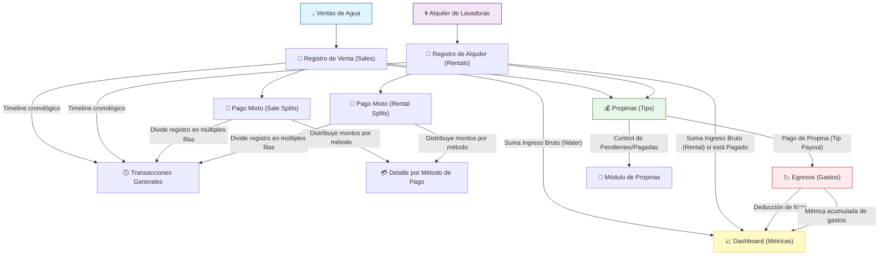

# AquaGest - Diagrama de Afectación y Dependencias

Este documento detalla cómo los registros en los módulos comerciales afectan a otros componentes del sistema, incluyendo métricas del dashboard, transacciones y egresos.

## 📊 Diagrama Lógico (Mermaid)

## 🧠 Análisis de Afectación

### 1. Módulos Comerciales (Agua y Alquiler)
- **Ventas de Agua**: Afectan de forma inmediata a los ingresos brutos, transacciones y métricas de litros vendidos en el dashboard.
- **Alquiler de Lavadoras**: Solo afectan financieramente al dashboard cuando se marcan como `Pagado` (`isPaid: true`). Sin embargo, aparecen en el listado de transacciones cronológicas y afectan la disponibilidad de máquinas desde su creación.

### 2. Pagos Mixtos (Mixed Payments)
- Los pagos mixtos utilizan tablas de "splits" (`sale_payment_splits`, `rental_payment_splits`).
- **Afectación en Dashboard**: Los totales por método de pago (`methodTotalsBs`) se calculan sumando cada split individualmente en lugar de asignar el total al método principal.
- **Afectación en Transacciones**: En el resumen de transacciones, un solo registro comercial se "explota" en múltiples filas, una por cada método de pago utilizado, para facilitar la conciliación de caja.

### 3. Propinas (Tips)
- Se capturan dentro del flujo de venta o alquiler pero se gestionan de forma independiente.
- **Módulo de Propinas**: Permite el seguimiento de propinas `Pendientes` vs `Pagadas`.
- **Módulo de Egresos**: **Crucial:** Una propina NO afecta los egresos ni el neto del dashboard hasta que es **pagada** (`tip_payout`). Una vez pagada, genera un registro de egreso que reduce el beneficio neto del negocio.

### 4. Dashboard y Métricas Globales
- El dashboard es un motor de cálculo en tiempo real que agrega datos de todos los módulos mencionados.
- El **Beneficio Neto** se calcula como: `(Ingresos Agua + Ingresos Alquiler Pagados + Prepagados) - (Gastos Generales + Propinas Pagadas)`.
