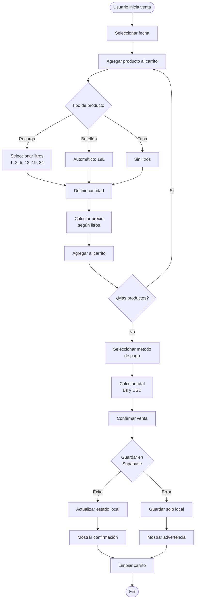
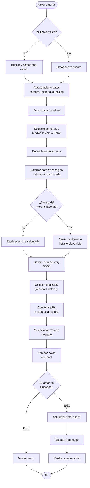
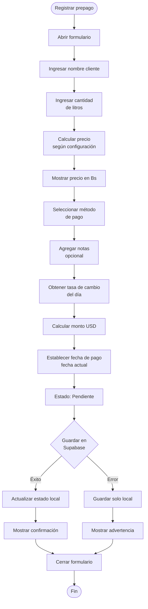
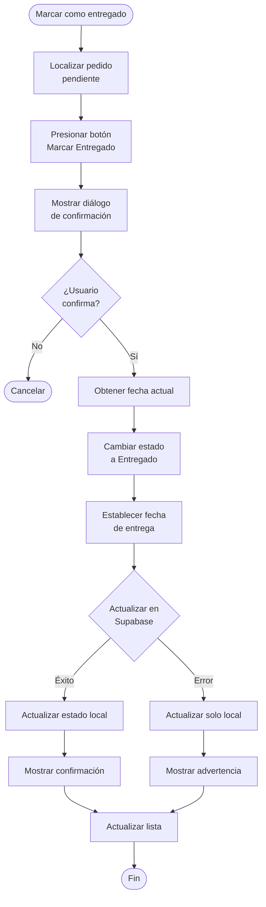
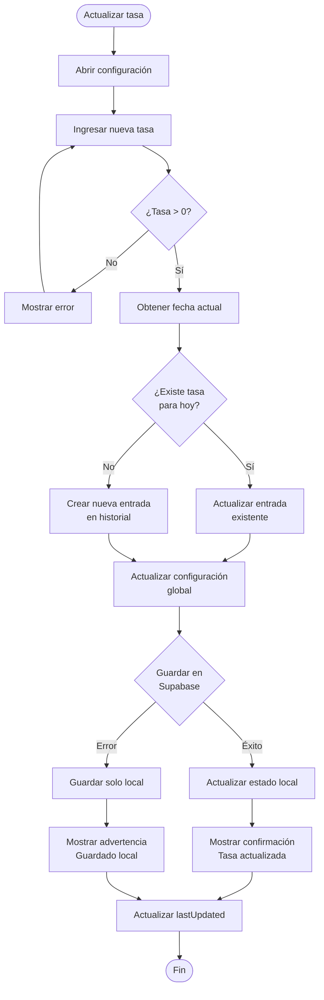
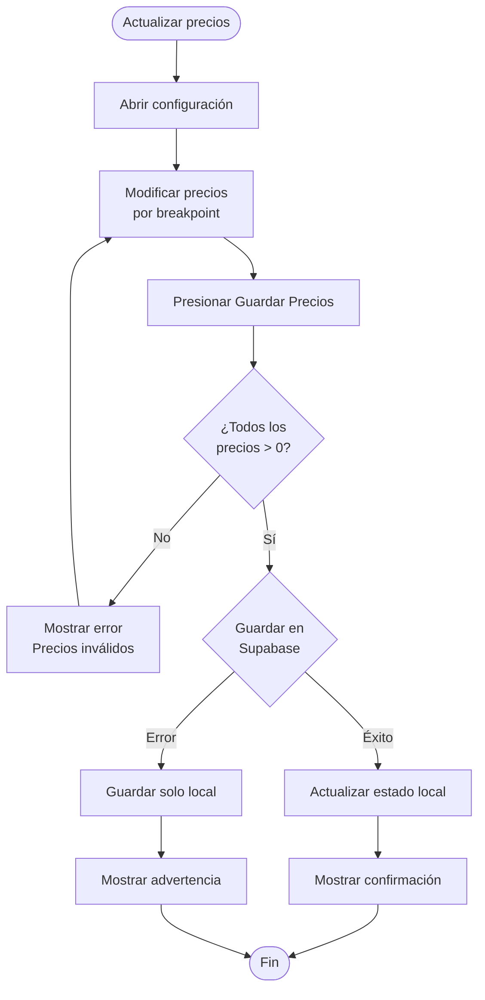
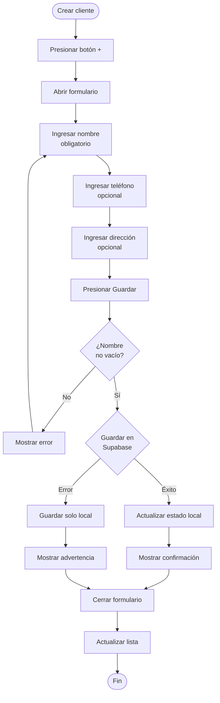
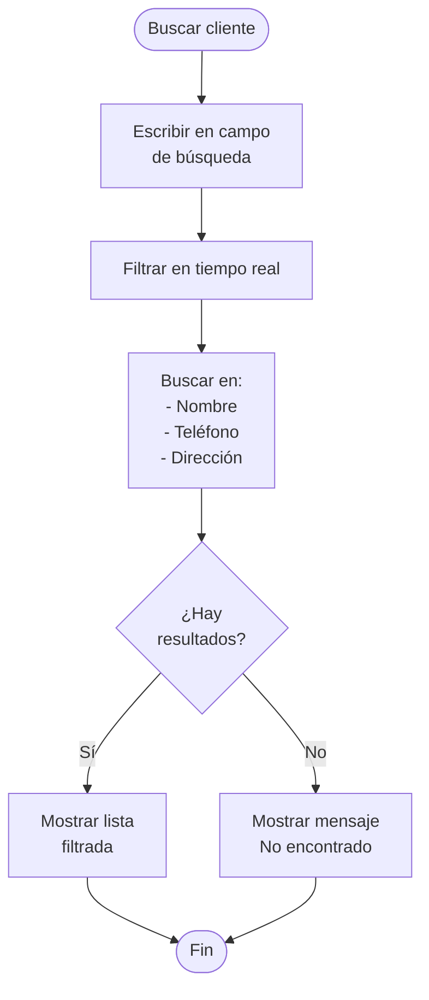
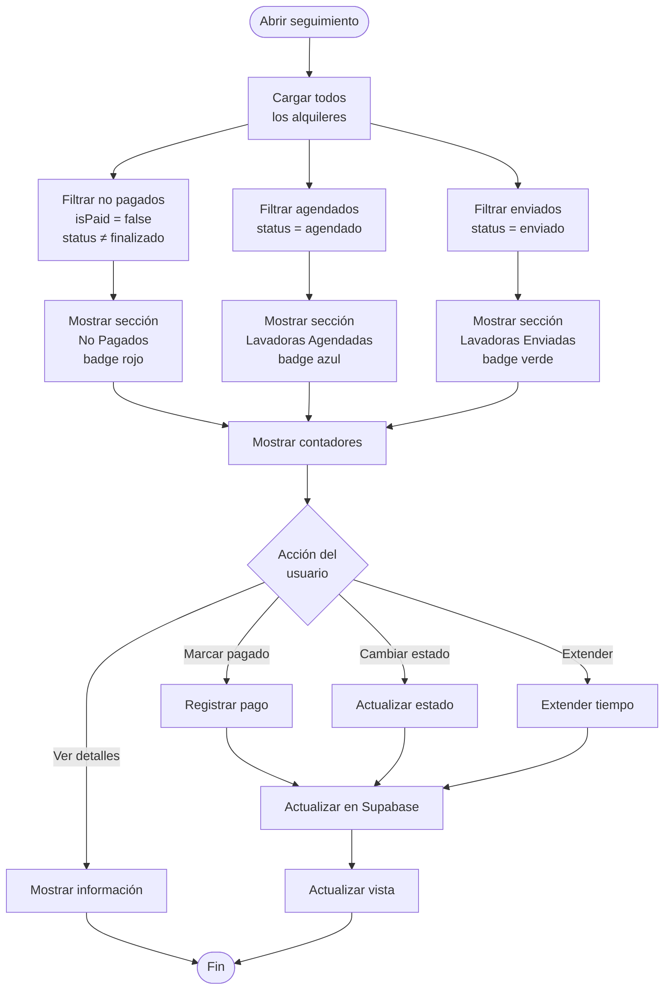
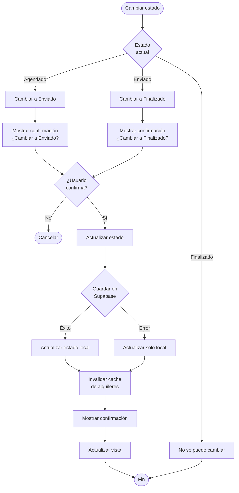

# Diagramas de Flujo - AquaGuest

Este documento contiene los diagramas de flujo de los procesos principales del sistema AquaGuest.

## Índice
1. [Flujo de Venta de Agua](#flujo-de-venta-de-agua)
2. [Flujo de Alquiler de Lavadora](#flujo-de-alquiler-de-lavadora)
3. [Flujo de Agua Prepagada](#flujo-de-agua-prepagada)
4. [Flujo de Configuración de Tasa](#flujo-de-configuración-de-tasa)
5. [Flujo de Gestión de Clientes](#flujo-de-gestión-de-clientes)
6. [Flujo de Seguimiento de Alquileres](#flujo-de-seguimiento-de-alquileres)
7. [Flujo de Extensión de Alquiler](#flujo-de-extensión-de-alquiler)

---

## Flujo de Venta de Agua



---

## Flujo de Alquiler de Lavadora



---

## Flujo de Agua Prepagada



### Flujo de Entrega de Prepago



---

## Flujo de Configuración de Tasa



### Flujo de Actualización de Precios por Litros



---

## Flujo de Gestión de Clientes

### Crear Cliente



### Buscar Cliente



---

## Flujo de Seguimiento de Alquileres



---

## Flujo de Extensión de Alquiler

```mermaid
flowchart TD
    Start([Extender alquiler]) --> CheckEligible{¿Alquiler<br/>elegible?}
    
    CheckEligible -->|No| ShowError[Mostrar error<br/>No se puede extender]
    CheckEligible -->|Sí| OpenDialog[Abrir diálogo<br/>de extensión]
    
    ShowError --> End([Fin])
    
    OpenDialog --> ShowCurrent[Mostrar datos actuales:<br/>- Hora recogida actual<br/>- Precio actual]
    ShowCurrent --> SelectType[Seleccionar tipo:<br/>Medio/Completo/Doble]
    
    SelectType --> CalcNewTime[Calcular nueva hora<br/>hora actual + duración]
    CalcNewTime --> CheckHours{¿Dentro del<br/>horario laboral?}
    
    CheckHours -->|Sí| SetNewTime[Establecer nueva hora]
    CheckHours -->|No| AdjustTime[Ajustar a horario<br/>disponible]
    
    SetNewTime --> CalcCost[Calcular costo<br/>adicional]
    AdjustTime --> CalcCost
    
    CalcCost --> ShowSummary[Mostrar resumen:<br/>- Nueva hora<br/>- Nueva fecha<br/>- Costo adicional<br/>- Total actualizado]
    
    ShowSummary --> UserConfirm{¿Usuario<br/>confirma?}
    UserConfirm -->|No| Cancel([Cancelar])
    UserConfirm -->|Sí| SaveOriginal[Guardar hora original<br/>si es primera extensión]
    
    SaveOriginal --> UpdateRental[Actualizar alquiler:<br/>- pickupTime<br/>- pickupDate<br/>- totalUsd<br/>- extensions[]]
    
    UpdateRental --> SaveSupabase{Guardar en<br/>Supabase}
    SaveSupabase -->|Éxito| UpdateLocal[Actualizar estado local]
    SaveSupabase -->|Error| UpdateLocalOnly[Actualizar solo local]
    
    UpdateLocal --> ShowSuccess[Mostrar confirmación]
    UpdateLocalOnly --> ShowWarning[Mostrar advertencia]
    
    ShowSuccess --> CloseDialog[Cerrar diálogo]
    ShowWarning --> CloseDialog
    CloseDialog --> RefreshView[Actualizar vista]
    RefreshView --> End
```

---

## Flujo de Cambio de Estado de Alquiler



---

## Notas sobre los Diagramas

### Convenciones Utilizadas:
- **Rectángulos redondeados**: Inicio/Fin del flujo
- **Rectángulos**: Procesos o acciones
- **Rombos**: Decisiones o validaciones
- **Colores implícitos**: 
  - Verde: Éxito
  - Rojo: Error
  - Amarillo: Advertencia
  - Azul: Información

### Patrones Comunes:
1. **Validación antes de guardar**: Todos los flujos validan datos antes de persistir
2. **Doble persistencia**: Se intenta guardar en Supabase, con fallback a local
3. **Feedback al usuario**: Siempre se muestra confirmación o error
4. **Sincronización**: Los cambios se reflejan inmediatamente en la UI

### Cómo Visualizar:
Estos diagramas están en formato Mermaid. Puedes visualizarlos en:
- GitHub (renderiza automáticamente)
- VS Code (con extensión Mermaid)
- Sitios web como mermaid.live
- Documentación generada con herramientas que soporten Mermaid
